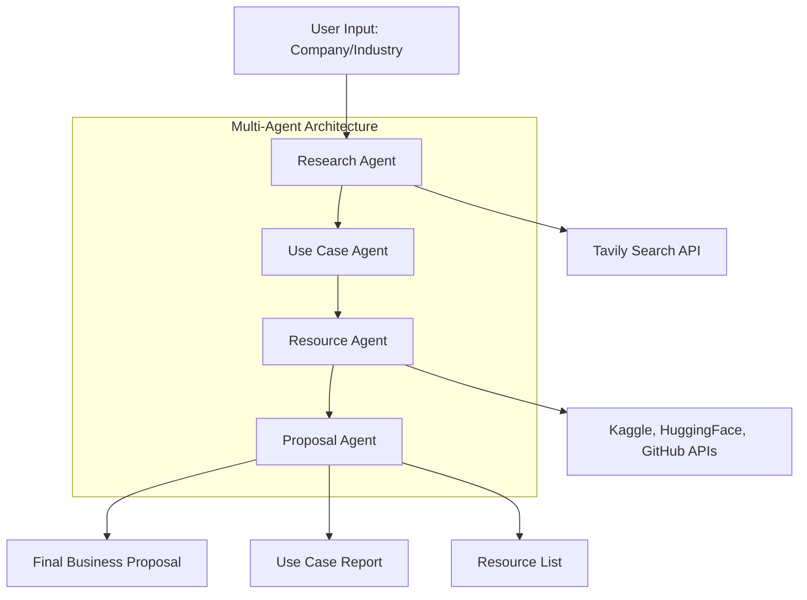

# 🤖 Market Research & Use Case Generation Agent (Multi-Agent System)

## 📌 Project Overview
This project is a multi-agent AI application that automates market research, AI use case generation, resource discovery, and business proposal creation for any company or industry.

It leverages Groq LLaMA3 models, LangChain + LangGraph, Tavily Search, Kaggle/HuggingFace/GitHub APIs, and a Streamlit UI.

## 🚀 Features

- 🔍 Market Research Agent – analyzes company/industry landscape using Tavily search

- 💡 Use Case Agent – suggests relevant AI/ML use cases (efficiency, customer experience, revenue growth)

- 📂 Resource Agent – finds datasets and repos from Kaggle, HuggingFace, and GitHub

- 📝 Proposal Agent – generates a structured business proposal with roadmap

- 🎨 Streamlit Dashboard – interactive interface with downloadable reports

- 📑 Auto-Generated Reports – saves resources, architecture diagrams, and full reports

## 📁 Project Structure
```
AI_Use_Case_Generator/
│
├── agentai.py          # Multi-agent orchestration logic
├── utils.py            # Kaggle, HuggingFace, GitHub API utils + report generators
├── app.py              # Streamlit frontend
├── outputs/            # Auto-saved reports, markdowns, diagrams
├── screen
└── README.md
```
## 📊 Agents Workflow



## 📑 Example Output

- Research Findings: Market & competitor insights with citations

- AI Use Cases: 2–3 concrete use cases with problem, tech, benefits, complexity

- Resources: Datasets & repos for implementation

- Proposal: Executive summary, roadmap, ROI

- Reports are auto-saved inside the outputs/ folder.


## 🎥 Demo Video
### Download Demo video Raw File 

[▶️ Watch Demo](screen/META1.mp4)


## 🔮 Future Improvements

- Add support for additional search APIs (e.g., SerpAPI, Perplexity)

- Expand proposal generation with financial modeling

- Enable PDF export of reports
